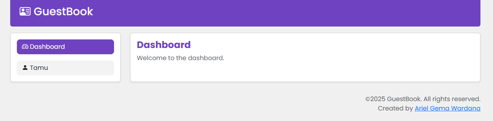
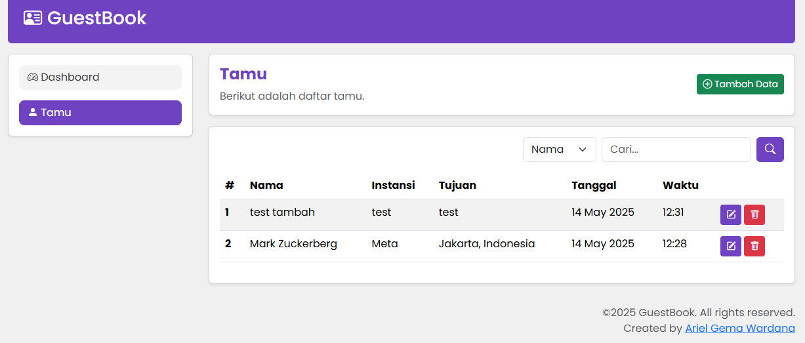
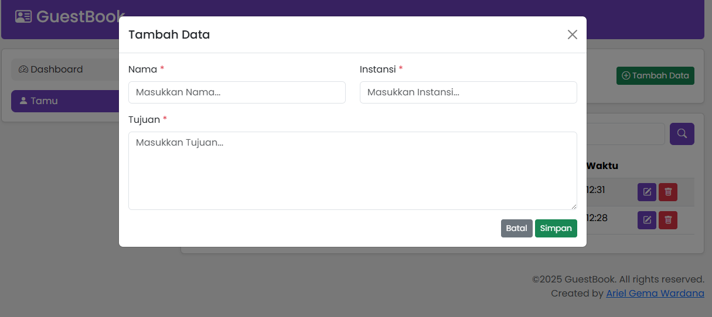
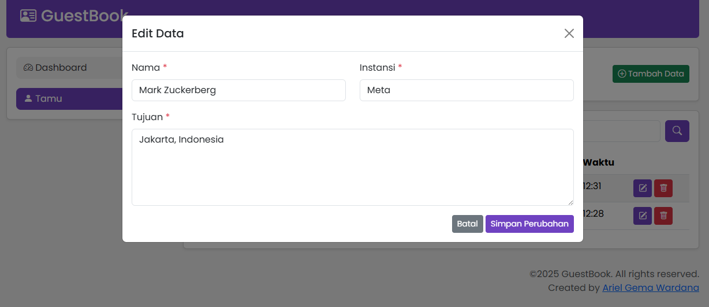
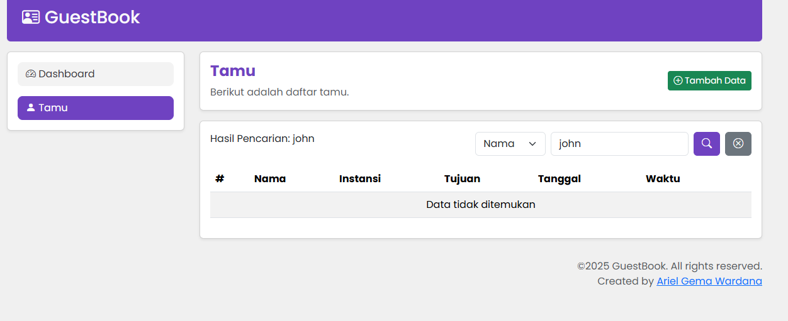

## Clone Repository
1. Buka file manager / Finder / file explorer
2. Kemudian masuk ke folder tempat `xampp\htdocs` (XAMPP) atau `laragon\www` (Laragon)
3. Lalu klik kanan pada area kosong lalu pilih `Open in Terminal` atau pilih `git bash`
4. Kemudian, jalankan perintah dibawah ini :
```bash
git clone https://github.com/ArielGwd/UAS_PemrogramanWeb2_ArielGemaWardana_230401010057.git
```  

## Import 
import database [db_bukutamu](db_bukutamu.sql) ke phpMyAdmin atau lainnya.

ketik `http://localhost/UAS_PemrogramanWeb2_ArielGemaWardana_230401010057/` pada browser untuk membukanya

## Preview
### - Dashboard
 

### - Tamu
 

### - Tambah Tamu
 

### - Edit Tamu
 

### - Search Tamu
 
